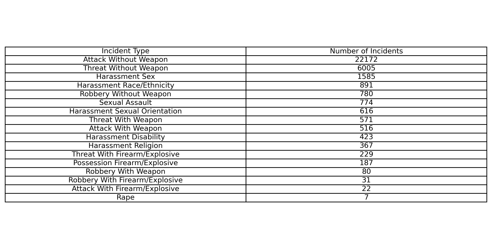
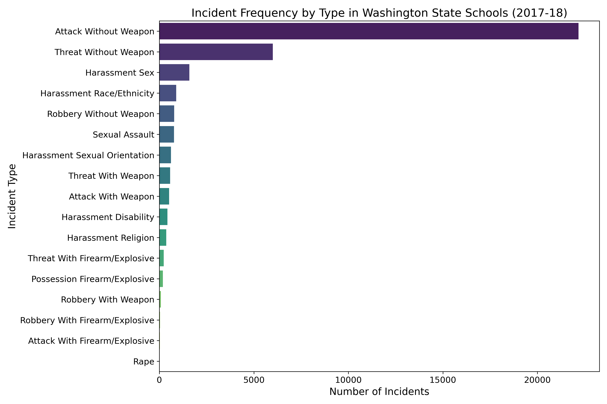

📊 Washington State CRDC Data – Harassment and Violence
🔹 Project Overview

This project analyzes the Civil Rights Data Collection (CRDC) – Harassment and Violence dataset for Washington State, collected by the Office for Civil Rights (OCR) of the U.S. Department of Education.

The dataset reports incidents of harassment, bullying, and violence in schools, including information by demographic groups.

⚠️ Important: Due to OCR privacy policies, most subgroup data (race, gender, disability, etc.) is suppressed.
Therefore, this analysis focuses only on StudentGroupType == 'AllStudents', representing aggregated school-level data.

This dataset allows us to explore general trends and patterns in harassment and violence across schools, but does not support detailed subgroup comparisons.

| Attribute                 | Details                                                     |
| ------------------------- | ----------------------------------------------------------- |
| **Data Year**             | 2017–18 school year                                         |
| **Data Last Updated**     | August 30, 2023                                             |
| **Metadata Last Updated** | May 5, 2025                                                 |
| **Source**                | U.S. Department of Education, Office for Civil Rights (OCR) |
| **Frequency**             | Biennial                                                    |

| Column                                                    | Description                                                                                                                                                                                              |
| --------------------------------------------------------- | -------------------------------------------------------------------------------------------------------------------------------------------------------------------------------------------------------- |
| **County**                                                | County where the school is located (39 unique counties).                                                                                                                                                 |
| **ESDName**                                               | Educational Service District (ESD) the school belongs to (12 ESDs in the dataset).                                                                                                                       |
| **DistrictName**                                          | Name of the school district (314 unique districts).                                                                                                                                                      |
| **SchoolName**                                            | Name of the school (2,159 unique schools).                                                                                                                                                               |
| **CurrentSchoolType**                                     | School type: `P` = Pre-K, `S` = Elementary, `I` = Intermediate, `A` = Alternative, `R` = Residential, `J` = Junior High, `5` = Grade 5, `Q` = Special Program, `V` = Vocational, `C` = Charter/Other. |
| **StudentGroupType**                                      | Type of student group (filtered dataset: only `AllStudents`).                                                                                                                                            |
| **StudentGroup**                                          | Student group name (filtered dataset: always `AllStudents`).                                                                                                                                             |
| **Allegations of harassment Based on Race/Ethnicity**     | Number of harassment incidents based on race/ethnicity.                                                                                                                                                  |
| **Allegations of harassment Based on Religion**           | Number of harassment incidents based on religion.                                                                                                                                                        |
| **Allegations of harassment Based on Sex**                | Number of harassment incidents based on sex.                                                                                                                                                             |
| **Allegations of harassment Based on Sexual Orientation** | Number of harassment incidents based on sexual orientation.                                                                                                                                              |
| **Allegations of harassment Based on Disability**         | Number of harassment incidents based on disability.                                                                                                                                                      |
| **IncidentsOfRape**                                       | Number of rape incidents.                                                                                                                                                                                |
| **IncidentsOfSexualAssault**                              | Number of sexual assault incidents.                                                                                                                                                                      |
| **IncidentsOfRobberyWithWeapon**                          | Number of robbery incidents with a weapon.                                                                                                                                                               |
| **IncidentsOfRobberyWithFirearmOrExplosive**              | Number of robbery incidents with a firearm or explosive.                                                                                                                                                 |
| **IncidentsOfRobberyWithoutWeapon**                       | Number of robbery incidents without a weapon.                                                                                                                                                            |
| **IncidentsOfAttackWithWeapon**                           | Number of attack incidents with a weapon.                                                                                                                                                                |
| **IncidentsOfAttackWithFirearmOrExplosive**               | Number of attack incidents with a firearm or explosive.                                                                                                                                                  |
| **IncidentsOfAttackWithoutWeapon**                        | Number of attack incidents without a weapon.                                                                                                                                                             |
| **IncidentsOfThreatAttackWithWeapon**                     | Number of threat-of-attack incidents with a weapon.                                                                                                                                                      |
| **IncidentsOfThreatAttackWithFirearmOrExplosive**         | Number of threat-of-attack incidents with a firearm or explosive.                                                                                                                                        |
| **IncidentsOfThreatAttackWithoutWeapon**                  | Number of threat-of-attack incidents without a weapon.                                                                                                                                                   |
| **IncidentsOfPosessionFireamOrExplosive**                 | Number of incidents of possession of a firearm or explosive.  

**Project Objectives & Key Questions 🧠
Objective**

Explore and analyze school-level harassment and violence incidents in Washington State, identifying patterns, trends, and differences across locations and school types.

**Key Questions**

**Incident Frequency by Type**

-Which types of incidents are most frequent in Washington schools?

### Incident Frequency Table

Are harassment, attacks, robberies, or sexual assault incidents more prevalent?

Geographic Comparison

Which counties or districts report the highest number of incidents?

Are there regional differences in incident occurrence?

Comparison by School Type

Which school types report more incidents?

Are there trends in incident types according to school type?

Patterns and Insights

Are there correlations between different incident types?

What overall insights can be drawn about school safety?

Dataset Limitations

Only aggregated data is available; subgroup-level analysis (e.g., race, gender, disability) is not possible.

Findings reflect general trends, not detailed demographic differences.|

🧹 Data Cleaning and Preparation

Only rows with StudentGroupType == 'AllStudents' were kept, as these are the only rows with numeric values.

This ensures reliable aggregated school-level data while eliminating suppressed or unavailable entries.

🔎 Exploratory Data Analysis (EDA)

The project notebook includes:

Dataset structure and summary statistics.

Distribution of incidents by harassment and violence type.

Comparison of incidents by school, district, and county.

Visualizations: bar charts, histograms, and county maps.

⚙️ Tools Used

Python: Pandas, NumPy

Visualization: Matplotlib, Seaborn

Environment: Jupyter Notebook
